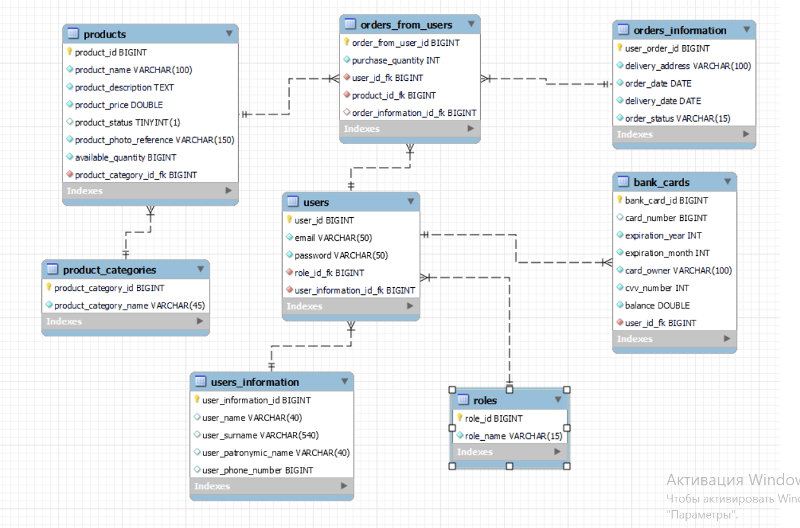

<h2 align="center">Online Store</h2>
<h4 align="center">Java Web Development (EPAM Systems)

Final project</h4>
 
### Description
The online store system. The administrator manages a catalogue of products. The customer makes orders and pays for them.

After creating an account and *logging in* to it, you can look at the catalogue, managing your shopping cart, making and cancelling your orders, viewing your profile and the store contact information. You can also change the language of the application(EN or RU).
In addition to the same functions as a regular user, the *administrator* has access to the following functions: adding new products to the catalogue and editing information about them, viewing and processing all active orders.

### General requirements for the project ###

* Implement an application using Servlet and JSP technologies.
* Application architecture must conform to *Layered Architecture* and *Model-View-Controller* patterns.
* The application interface must be internationalized.
* Exceptions must be correctly handled and logged by *Log4j* logger.
* Classes and other entities must be well-structured by packages and have names which reflect their functionality.
* When implementing the business logic of an application, it is recommended to use design patterns (for example, Factory Method, Command, Builder, Strategy, Observer)
and avoid the procedural style of programming.
* Use a session to store user information between requests.
* Use JSTL library tags when implementing JSP pages.
* Scriptlets are not allowed.
* Viewing "long lists" it is recommended to organize in page mode.
* Documentation for the project must be drawn according to the requirements of javadoc.
* Code style must comply with the Java Code Convention.
* Implement protection against re-submission of the form by pressing F5.
* Validate input data on both the client and server sides.
* Application must contain TestNG, JUnit, Mockito or EasyMock tests.
* Use Maven to build the application.

### General requirements for the database ###
* Information about the data domain should be stored in the database.
* It is recommended to use utf-8 Encoding.
* Use only the JDBC technology for database access.
* A connection pool must be implemented for working with the database.
* It is recommended to use no more than 6-8 tables when designing the database.
* DAO pattern

### General requirements for the functionality of the application ###

1. Login to and logout of the system  
2. User registration  
3. Viewing information (for example: all courses, available credit card accounts, etc.)
4. Removing information (for example: cancelling an order, medical prescription, refusal for course of study etc.)  
5. Adding and editing information (for example: create and alter a course, make and alter an order, etc.)

### Database schema ###

